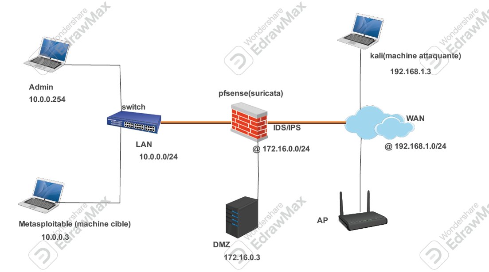
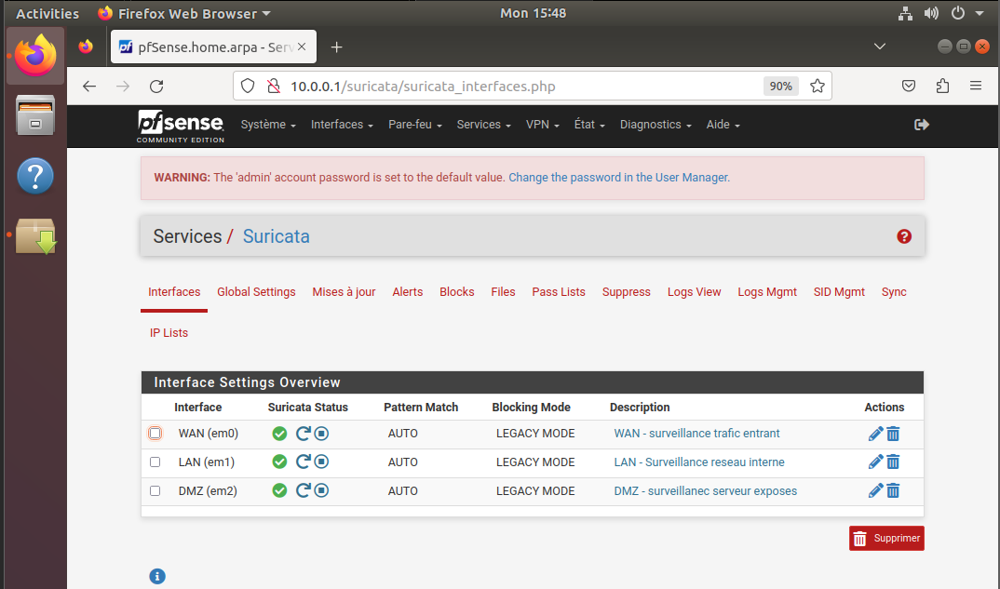
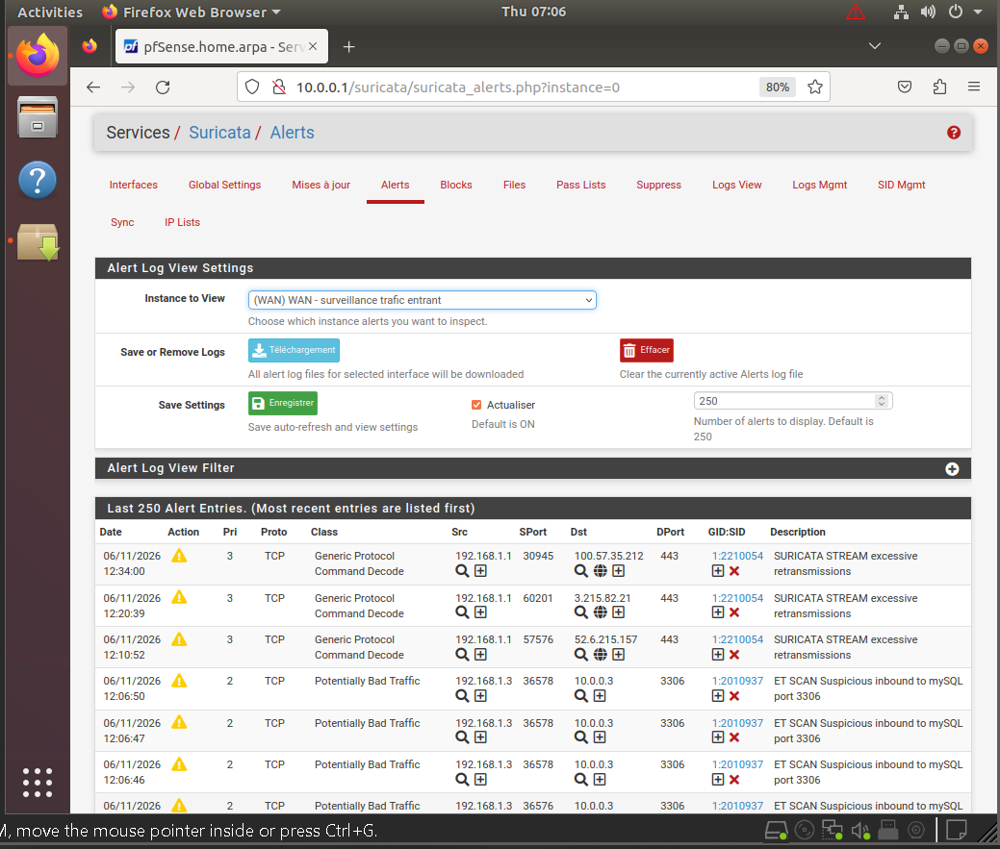

# 🔐 Suricata IDS/IPS Lab


Déploiement d'un système complet de détection et prévention d'intrusions 
basé sur une architecture 3 VMs VMware. Simulation d'attaques réelles 
depuis Kali Linux contre Metasploitable 2, détectées et bloquées par 
Suricata avec visualisation via EveBox.

---

## 🏗️ Architecture du lab

| VM | Rôle | Système |
|---|---|---|
| VM 1 | IDS/IPS — Détection & Prévention | Ubuntu Server 22.04 + Suricata + EveBox |
| VM 2 | Cible vulnérable | Metasploitable 2 |
| VM 3 | Machine attaquante | Kali Linux |



---

## ⚙️ Technologies utilisées

- **Suricata** — moteur IDS/IPS open source
- **EveBox** — interface web de visualisation des alertes Suricata
- **Kali Linux** — tests d'intrusion (Nmap, Metasploit)
- **Metasploitable 2** — cible intentionnellement vulnérable
- **VMware Workstation** — virtualisation

---

## 🚀 Attaques simulées et détectées

- Scan de ports avec **Nmap**
- Exploitation de la vulnérabilité **vsftpd 2.3.4** via Metasploit
- Attaque **brute force SSH**
- Détection en temps réel via les règles Suricata


---

## 📋 Configuration Suricata

```yaml
# Mode IPS activé
af-packet:
  - interface: eth0
    copy-mode: ips
    copy-iface: eth1
```



---

## 📊 Résultats obtenus

- ✅ Détection de scans Nmap en temps réel
- ✅ Alertes générées sur exploitation vsftpd
- ✅ Blocage du trafic malveillant en mode IPS
- ✅ Visualisation complète via dashboard EveBox



---

## 🧠 Ce que j'ai appris

- La différence concrète entre mode IDS (détection) et IPS (blocage actif)
- L'écriture et la personnalisation de règles Suricata
- L'analyse des logs réseau et la corrélation d'alertes
- La mise en place d'un environnement de test isolé et sécurisé

---

## 👤 Auteur

**Franck Nkombou**
Étudiant RSI3 — École Supérieure Technique La Salle, Douala

[](https://linkedin.com/in/ton-profil)
[](https://github.com/nkombou)
