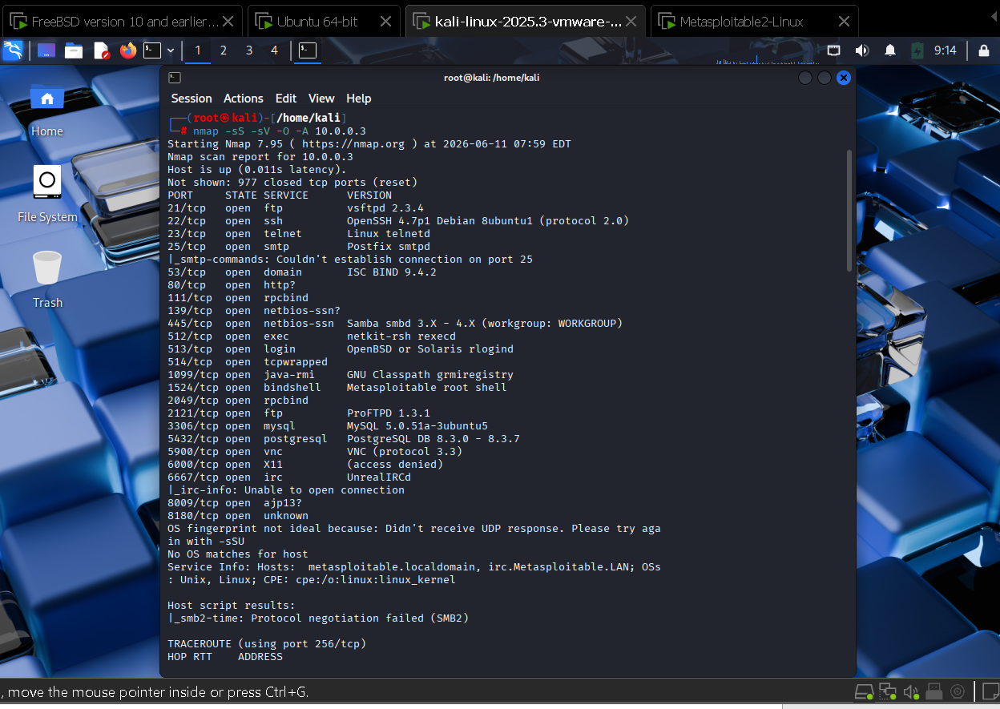

# 🔐 Suricata IDS/IPS Lab — pfSense


Déploiement d'un système complet de détection et prévention d'intrusions
basé sur Suricata intégré dans pfSense. Simulation d'attaques réelles
depuis Kali Linux contre Metasploitable 2, détectées en temps réel
via l'interface d'alertes pfSense/Suricata.

---

## 🏗️ Architecture du lab

| VM | Rôle | Système |
|---|---|---|
| VM 1 | Firewall + IDS/IPS | pfSense + Suricata |
| VM 2 | Cible vulnérable | Metasploitable 2 — 10.0.0.3 |
| VM 3 | Machine attaquante | Kali Linux — 192.168.1.3 |


---

## ⚙️ Technologies utilisées

- **pfSense** — Firewall open source avec Suricata intégré
- **Suricata** — Moteur IDS/IPS — surveillance WAN, LAN et DMZ
- **Kali Linux** — Tests d'intrusion (Nmap, Metasploit)
- **Metasploitable 2** — Cible intentionnellement vulnérable
- **VMware Workstation** — Virtualisation

---

## 🔍 Configuration Suricata sur pfSense

Suricata configuré en surveillance sur 3 interfaces simultanées :

| Interface | Mode | Description |
|---|---|---|
| WAN (em0) | Legacy Mode | Surveillance trafic entrant |
| LAN (em1) | Legacy Mode | Surveillance réseau interne |
| DMZ (em2) | Legacy Mode | Surveillance serveurs exposés |


---

## 💥 Attaques simulées et détectées

### Phase 1 — Reconnaissance (Nmap)
Scan complet de la cible Metasploitable 2 depuis Kali Linux :

```bash
nmap -sS -sV -O -A 10.0.0.3
```

Résultats du scan — ports vulnérables découverts :
- Port 21 — vsftpd 2.3.4 (vulnérable)
- Port 22 — OpenSSH
- Port 80 — HTTP
- Port 3306 — MySQL 5.0.51a



### Phase 2 — Alertes détectées par Suricata
Suricata détecte et journalise en temps réel :
- Trafic suspect inbound vers MySQL (port 3306)
- Connexions TCP anormales
- Tentatives de scan de ports


---

## 📊 Résultats obtenus

- ✅ Suricata opérationnel sur 3 interfaces (WAN, LAN, DMZ)
- ✅ Détection en temps réel des scans Nmap
- ✅ Alertes générées sur trafic suspect vers MySQL
- ✅ Journalisation complète des 250 dernières alertes
- ✅ Simulation d'environnement réseau d'entreprise avec DMZ

---

## 🧠 Ce que j'ai appris

- Intégration de Suricata directement dans pfSense
- Différence concrète entre mode IDS (détection) et IPS (blocage)
- Configuration de la surveillance multi-interfaces
- Analyse des alertes réseau et corrélation d'événements
- Mise en place d'une architecture réseau avec DMZ isolée

---

## 👤 Auteur

**Franck Nkombou**
Étudiant RSI3 — École Supérieure Technique La Salle, Douala

[](https://github.com/nkombou)
